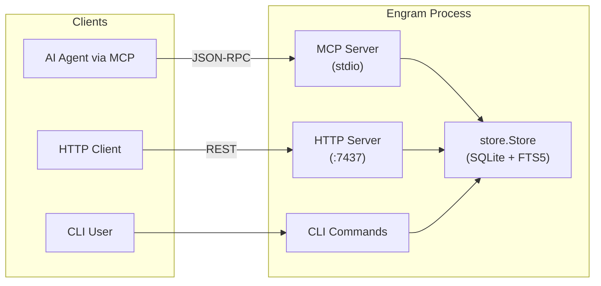
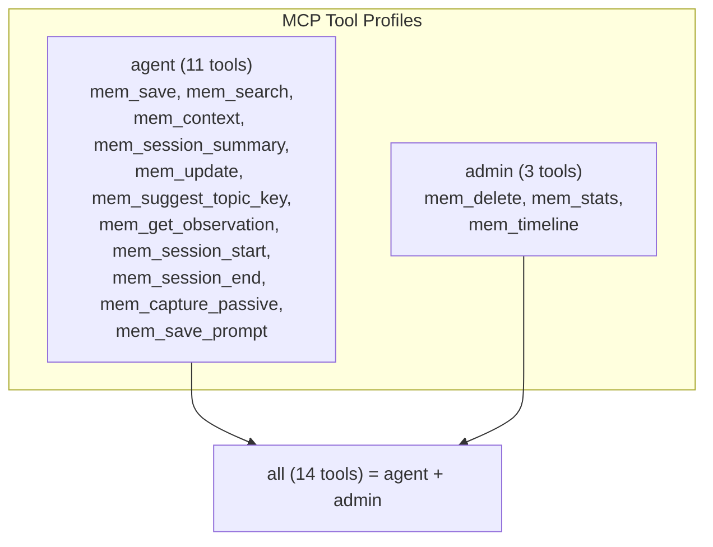
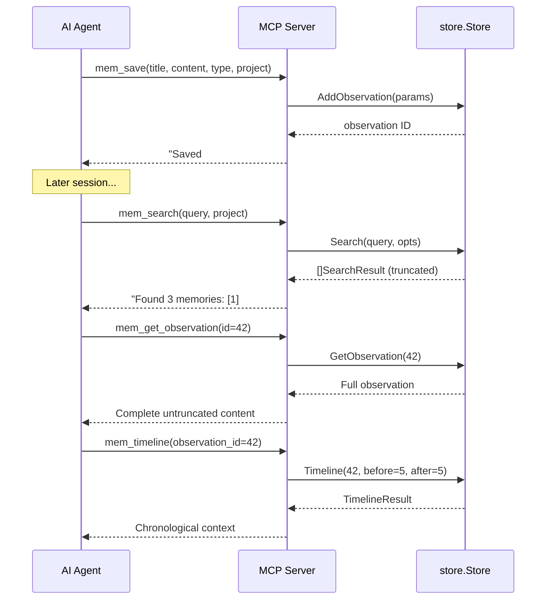

# API Reference

Engram exposes three API surfaces: an **HTTP REST API** for external clients, an **MCP server** (stdio transport) for AI agent integrations, and a **CLI** for direct terminal interaction. All three share the same underlying `store.Store` data layer.

---

## Overview

| Surface | Transport | Base URL / Invocation | Format |
|---------|-----------|----------------------|--------|
| HTTP REST API | TCP | `http://127.0.0.1:7437` | JSON |
| MCP Server | stdio | `engram mcp [--tools=PROFILE]` | MCP protocol (JSON-RPC) |
| CLI | Process | `engram <command> [args]` | Plain text / JSON files |

- **Authentication**: The local HTTP server binds to `127.0.0.1` only — no authentication required. Cloud endpoints use JWT tokens (`ENGRAM_JWT_SECRET`).
- **Response format**: All HTTP endpoints return `application/json`. Errors use `{"error": "<message>"}`.
- **Default port**: `7437` (override via `ENGRAM_PORT` environment variable).

---

## HTTP REST API

Defined in `internal/server/server.go`. The server is created via `server.New(store, port)` and started with `server.Start()`.

### Health

#### `GET /health`

Returns service health status.

**Response** `200 OK`:

```json
{
  "status": "ok",
  "service": "engram",
  "version": "0.1.0"
}
```

**Example**:

```bash
curl http://127.0.0.1:7437/health
```

---

### Sessions

#### `POST /sessions`

Create a new coding session.

**Request body**:

| Field | Type | Required | Description |
|-------|------|----------|-------------|
| `id` | string | ✅ | Unique session identifier |
| `project` | string | ✅ | Project name |
| `directory` | string | | Working directory path |

**Response** `201 Created`:

```json
{ "id": "abc-123", "status": "created" }
```

**Example**:

```bash
curl -X POST http://127.0.0.1:7437/sessions \
  -H "Content-Type: application/json" \
  -d '{"id": "sess-1", "project": "my-project", "directory": "/home/user/code"}'
```

#### `POST /sessions/{id}/end`

End a session with an optional summary.

**Path parameters**:

| Param | Description |
|-------|-------------|
| `id` | Session identifier |

**Request body** (optional):

| Field | Type | Description |
|-------|------|-------------|
| `summary` | string | Summary of what was accomplished |

**Response** `200 OK`:

```json
{ "id": "sess-1", "status": "completed" }
```

#### `GET /sessions/recent`

List recent sessions.

**Query parameters**:

| Param | Type | Default | Description |
|-------|------|---------|-------------|
| `project` | string | | Filter by project name |
| `limit` | int | `5` | Maximum number of sessions to return |

**Example**:

```bash
curl "http://127.0.0.1:7437/sessions/recent?project=engram&limit=10"
```

---

### Observations

#### `POST /observations`

Save a new observation (memory).

**Request body** (`store.AddObservationParams`):

| Field | Type | Required | Description |
|-------|------|----------|-------------|
| `session_id` | string | ✅ | Associated session ID |
| `title` | string | ✅ | Short, searchable title |
| `content` | string | ✅ | Observation content |
| `type` | string | | Category (e.g. `decision`, `bugfix`, `architecture`) |
| `project` | string | | Project name |
| `scope` | string | | `project` (default) or `personal` |
| `topic_key` | string | | Topic identifier for upserts |

**Response** `201 Created`:

```json
{ "id": 42, "status": "saved" }
```

**Example**:

```bash
curl -X POST http://127.0.0.1:7437/observations \
  -H "Content-Type: application/json" \
  -d '{
    "session_id": "sess-1",
    "title": "Fixed N+1 query in user list",
    "content": "**What**: Added eager loading...",
    "type": "bugfix",
    "project": "my-app"
  }'
```

#### `POST /observations/passive`

Passive capture — extract and save structured learnings from text.

**Request body** (`store.PassiveCaptureParams`):

| Field | Type | Required | Description |
|-------|------|----------|-------------|
| `session_id` | string | ✅ | Associated session ID |
| `content` | string | | Text containing learnings to extract |
| `project` | string | | Project name |
| `source` | string | | Source identifier |

**Response** `200 OK`: Returns the capture result from the store.

#### `GET /observations/recent`

List recent observations.

**Query parameters**:

| Param | Type | Default | Description |
|-------|------|---------|-------------|
| `project` | string | | Filter by project |
| `scope` | string | | Filter by scope (`project` or `personal`) |
| `limit` | int | `20` | Maximum results |

#### `GET /observations/{id}`

Get a single observation by numeric ID.

**Path parameters**:

| Param | Description |
|-------|-------------|
| `id` | Observation ID (integer) |

**Response** `200 OK`: Full observation object.
**Response** `404 Not Found`: `{"error": "observation not found"}`

#### `PATCH /observations/{id}`

Update an existing observation. Only provided fields are changed.

**Path parameters**:

| Param | Description |
|-------|-------------|
| `id` | Observation ID (integer) |

**Request body** (`store.UpdateObservationParams`) — at least one field required:

| Field | Type | Description |
|-------|------|-------------|
| `type` | *string | New category |
| `title` | *string | New title |
| `content` | *string | New content |
| `project` | *string | New project |
| `scope` | *string | New scope |
| `topic_key` | *string | New topic key |

**Response** `200 OK`: Updated observation object.

#### `DELETE /observations/{id}`

Delete an observation. Soft-delete by default.

**Path parameters**:

| Param | Description |
|-------|-------------|
| `id` | Observation ID (integer) |

**Query parameters**:

| Param | Type | Default | Description |
|-------|------|---------|-------------|
| `hard` | bool | `false` | Permanently delete if `true` |

**Response** `200 OK`:

```json
{ "id": 42, "status": "deleted", "hard_delete": false }
```

---

### Search

#### `GET /search`

Full-text search across all observations.

**Query parameters**:

| Param | Type | Default | Required | Description |
|-------|------|---------|----------|-------------|
| `q` | string | | ✅ | Search query (natural language or keywords) |
| `type` | string | | | Filter by observation type |
| `project` | string | | | Filter by project |
| `scope` | string | | | Filter by scope |
| `limit` | int | `10` | | Maximum results |

**Example**:

```bash
curl "http://127.0.0.1:7437/search?q=auth+middleware&project=my-app&limit=5"
```

---

### Timeline

#### `GET /timeline`

Show chronological context around a specific observation.

**Query parameters**:

| Param | Type | Default | Required | Description |
|-------|------|---------|----------|-------------|
| `observation_id` | int | | ✅ | Observation ID to center on |
| `before` | int | `5` | | Observations to show before |
| `after` | int | `5` | | Observations to show after |

**Example**:

```bash
curl "http://127.0.0.1:7437/timeline?observation_id=42&before=3&after=3"
```

---

### Prompts

#### `POST /prompts`

Save a user prompt to persistent memory.

**Request body** (`store.AddPromptParams`):

| Field | Type | Required | Description |
|-------|------|----------|-------------|
| `session_id` | string | ✅ | Associated session ID |
| `content` | string | ✅ | The user's prompt text |
| `project` | string | | Project name |

**Response** `201 Created`:

```json
{ "id": 7, "status": "saved" }
```

#### `GET /prompts/recent`

List recent prompts.

**Query parameters**:

| Param | Type | Default | Description |
|-------|------|---------|-------------|
| `project` | string | | Filter by project |
| `limit` | int | `20` | Maximum results |

#### `GET /prompts/search`

Search prompts by keyword.

**Query parameters**:

| Param | Type | Default | Required | Description |
|-------|------|---------|----------|-------------|
| `q` | string | | ✅ | Search query |
| `project` | string | | | Filter by project |
| `limit` | int | `10` | | Maximum results |

---

### Context

#### `GET /context`

Get formatted recent memory context from previous sessions.

**Query parameters**:

| Param | Type | Description |
|-------|------|-------------|
| `project` | string | Filter by project |
| `scope` | string | Filter by scope |

**Response** `200 OK`:

```json
{ "context": "## Recent Sessions\n..." }
```

---

### Export / Import

#### `GET /export`

Export all memories as a JSON file. Returns `Content-Disposition: attachment; filename=engram-export.json`.

**Example**:

```bash
curl http://127.0.0.1:7437/export -o engram-export.json
```

#### `POST /import`

Import memories from a JSON export. Body limit: 50 MB.

**Request body**: `store.ExportData` JSON structure (as produced by `GET /export`).

**Response** `200 OK`: Import result summary.

**Example**:

```bash
curl -X POST http://127.0.0.1:7437/import \
  -H "Content-Type: application/json" \
  -d @engram-export.json
```

---

### Stats

#### `GET /stats`

Show memory system statistics (total sessions, observations, projects).

**Example**:

```bash
curl http://127.0.0.1:7437/stats
```

---

### Sync Status

#### `GET /sync/status`

Show background sync status. Returns sync disabled message if autosync is not configured.

**Response** `200 OK` (sync enabled):

```json
{
  "enabled": true,
  "phase": "idle",
  "last_error": "",
  "consecutive_failures": 0,
  "backoff_until": null,
  "last_sync_at": "2026-04-08T12:00:00Z"
}
```

**Response** `200 OK` (sync disabled):

```json
{
  "enabled": false,
  "message": "background sync is not configured"
}
```

---

## Endpoint Summary

| Method | Path | Description |
|--------|------|-------------|
| `GET` | `/health` | Health check |
| `POST` | `/sessions` | Create session |
| `POST` | `/sessions/{id}/end` | End session |
| `GET` | `/sessions/recent` | List recent sessions |
| `POST` | `/observations` | Save observation |
| `POST` | `/observations/passive` | Passive capture |
| `GET` | `/observations/recent` | List recent observations |
| `GET` | `/observations/{id}` | Get observation by ID |
| `PATCH` | `/observations/{id}` | Update observation |
| `DELETE` | `/observations/{id}` | Delete observation |
| `GET` | `/search` | Full-text search |
| `GET` | `/timeline` | Chronological context |
| `POST` | `/prompts` | Save prompt |
| `GET` | `/prompts/recent` | List recent prompts |
| `GET` | `/prompts/search` | Search prompts |
| `GET` | `/context` | Get memory context |
| `GET` | `/export` | Export all data |
| `POST` | `/import` | Import data |
| `GET` | `/stats` | System statistics |
| `GET` | `/sync/status` | Sync status |

---

## MCP Server

Defined in `internal/mcp/mcp.go`. The MCP server uses stdio transport (JSON-RPC over stdin/stdout) and is started via `engram mcp`. It exposes 14 tools organized into two profiles.

### Tool Profiles

Profiles control which tools are registered, reducing noise for agents that don't need admin capabilities.

| Profile | Tools | Description |
|---------|-------|-------------|
| `agent` | 11 tools | Tools AI agents use during coding sessions |
| `admin` | 3 tools | Tools for TUI, dashboards, and manual curation |
| `all` | 14 tools | Every tool (default) |

Profiles can be combined: `--tools=agent,admin` or individual tools selected: `--tools=mem_save,mem_search`.

```bash
# All 14 tools (default)
engram mcp

# Only agent tools (recommended for AI agents)
engram mcp --tools=agent

# Combine profiles
engram mcp --tools=agent,admin

# Individual tools
engram mcp --tools=mem_save,mem_search,mem_context
```

### Agent Profile Tools

These tools are loaded eagerly (always in context) or deferred (loaded on demand by MCP clients).

#### `mem_search` — Search Memory

Search persistent memory across all sessions.

| Parameter | Type | Required | Description |
|-----------|------|----------|-------------|
| `query` | string | ✅ | Natural language or keyword search query |
| `type` | string | | Filter: `tool_use`, `file_change`, `command`, `file_read`, `search`, `manual`, `decision`, `architecture`, `bugfix`, `pattern` |
| `project` | string | | Filter by project name |
| `scope` | string | | `project` (default) or `personal` |
| `limit` | number | | Max results (default: 10, max: 20) |

**Loading**: Eager (always in context). Read-only, idempotent.

#### `mem_save` — Save Memory

Save an observation to persistent memory. Supports topic-based upserts via `topic_key`.

| Parameter | Type | Required | Description |
|-----------|------|----------|-------------|
| `title` | string | ✅ | Short, searchable title |
| `content` | string | ✅ | Structured content (use `**What**`, `**Why**`, `**Where**`, `**Learned**` format) |
| `type` | string | | Category: `decision`, `architecture`, `bugfix`, `pattern`, `config`, `discovery`, `learning` (default: `manual`) |
| `session_id` | string | | Session ID (default: `manual-save-{project}`) |
| `project` | string | | Project name |
| `scope` | string | | `project` (default) or `personal` |
| `topic_key` | string | | Topic identifier for upserts (e.g. `architecture/auth-model`) |

**Loading**: Eager. Write operation, not idempotent.

#### `mem_context` — Get Memory Context

Get recent memory context from previous sessions.

| Parameter | Type | Required | Description |
|-----------|------|----------|-------------|
| `project` | string | | Filter by project |
| `scope` | string | | `project` (default) or `personal` |
| `limit` | number | | Number of observations (default: 20) |

**Loading**: Eager. Read-only, idempotent.

#### `mem_session_summary` — Save Session Summary

Save a comprehensive end-of-session summary with structured format (Goal, Instructions, Discoveries, Accomplished, Relevant Files).

| Parameter | Type | Required | Description |
|-----------|------|----------|-------------|
| `content` | string | ✅ | Full session summary |
| `session_id` | string | | Session ID (default: `manual-save-{project}`) |
| `project` | string | ✅ | Project name |

**Loading**: Eager. Write operation.

#### `mem_update` — Update Memory

Update an existing observation by ID. Only provided fields are changed.

| Parameter | Type | Required | Description |
|-----------|------|----------|-------------|
| `id` | number | ✅ | Observation ID to update |
| `title` | string | | New title |
| `content` | string | | New content |
| `type` | string | | New category |
| `project` | string | | New project |
| `scope` | string | | New scope |
| `topic_key` | string | | New topic key |

**Loading**: Deferred. Write operation.

#### `mem_suggest_topic_key` — Suggest Topic Key

Suggest a stable `topic_key` for memory upserts. Use before `mem_save` for evolving topics.

| Parameter | Type | Required | Description |
|-----------|------|----------|-------------|
| `type` | string | | Observation category |
| `title` | string | | Observation title (preferred input) |
| `content` | string | | Fallback if title is empty |

**Loading**: Deferred. Read-only, idempotent.

#### `mem_get_observation` — Get Observation

Get full, untruncated content of an observation by ID.

| Parameter | Type | Required | Description |
|-----------|------|----------|-------------|
| `id` | number | ✅ | Observation ID |

**Loading**: Deferred. Read-only, idempotent.

#### `mem_session_start` — Start Session

Register the start of a new coding session.

| Parameter | Type | Required | Description |
|-----------|------|----------|-------------|
| `id` | string | ✅ | Unique session identifier |
| `project` | string | ✅ | Project name |
| `directory` | string | | Working directory |

**Loading**: Deferred. Write operation, idempotent.

#### `mem_session_end` — End Session

Mark a session as completed.

| Parameter | Type | Required | Description |
|-----------|------|----------|-------------|
| `id` | string | ✅ | Session identifier |
| `summary` | string | | Summary of work done |

**Loading**: Deferred. Write operation, idempotent.

#### `mem_capture_passive` — Capture Learnings

Extract and save structured learnings from text output. Looks for `## Key Learnings:` sections and saves each item as a separate observation. Duplicate-safe.

| Parameter | Type | Required | Description |
|-----------|------|----------|-------------|
| `content` | string | ✅ | Text containing `## Key Learnings:` section |
| `session_id` | string | | Session ID |
| `project` | string | | Project name |
| `source` | string | | Source identifier (e.g. `subagent-stop`, `session-end`) |

**Loading**: Deferred. Write operation, idempotent.

#### `mem_save_prompt` — Save User Prompt

Save a user prompt to memory for future session context.

| Parameter | Type | Required | Description |
|-----------|------|----------|-------------|
| `content` | string | ✅ | The user's prompt text |
| `session_id` | string | | Session ID |
| `project` | string | | Project name |

**Loading**: Deferred. Write operation.

### Admin Profile Tools

#### `mem_delete` — Delete Memory

Delete an observation by ID.

| Parameter | Type | Required | Description |
|-----------|------|----------|-------------|
| `id` | number | ✅ | Observation ID |
| `hard_delete` | boolean | | Permanently delete if `true` (default: soft-delete) |

**Loading**: Deferred. Destructive operation.

#### `mem_stats` — Memory Stats

Show total sessions, observations, and projects tracked. No parameters.

**Loading**: Deferred. Read-only.

#### `mem_timeline` — Memory Timeline

Show chronological context around a specific observation. Progressive disclosure: search first with `mem_search`, then drill into timeline.

| Parameter | Type | Required | Description |
|-----------|------|----------|-------------|
| `observation_id` | number | ✅ | Observation ID to center on |
| `before` | number | | Observations before (default: 5) |
| `after` | number | | Observations after (default: 5) |

**Loading**: Deferred. Read-only, idempotent.

### MCP Tool Summary

| Tool | Profile | Loading | Read-Only | Destructive |
|------|---------|---------|-----------|-------------|
| `mem_search` | agent | Eager | ✅ | |
| `mem_save` | agent | Eager | | |
| `mem_context` | agent | Eager | ✅ | |
| `mem_session_summary` | agent | Eager | | |
| `mem_update` | agent | Deferred | | |
| `mem_suggest_topic_key` | agent | Deferred | ✅ | |
| `mem_get_observation` | agent | Deferred | ✅ | |
| `mem_session_start` | agent | Deferred | | |
| `mem_session_end` | agent | Deferred | | |
| `mem_capture_passive` | agent | Deferred | | |
| `mem_save_prompt` | agent | Deferred | | |
| `mem_delete` | admin | Deferred | | ✅ |
| `mem_stats` | admin | Deferred | ✅ | |
| `mem_timeline` | admin | Deferred | ✅ | |

### MCP Configuration

Add to your agent's MCP config:

```json
{
  "mcpServers": {
    "engram": {
      "type": "stdio",
      "command": "engram",
      "args": ["mcp", "--tools=agent"]
    }
  }
}
```

---

## CLI Reference

Entry point: `cmd/engram/main.go`.

### Commands

| Command | Description |
|---------|-------------|
| `engram serve [port]` | Start HTTP API server (default port: `7437`) |
| `engram mcp [--tools=PROFILE]` | Start MCP server (stdio transport) |
| `engram tui` | Launch interactive terminal UI (Bubble Tea) |
| `engram search <query>` | Search memories |
| `engram save <title> <msg>` | Save a memory |
| `engram timeline <obs_id>` | Show context around an observation |
| `engram context [project]` | Show recent context from previous sessions |
| `engram stats` | Show memory system statistics |
| `engram export [file]` | Export all memories to JSON (default: `engram-export.json`) |
| `engram import <file>` | Import memories from JSON |
| `engram setup [agent]` | Install agent integration |
| `engram sync` | Export new memories as compressed chunk |
| `engram cloud <subcommand>` | Cloud sync operations |
| `engram version` | Print version |

### Search Flags

```bash
engram search <query> [--type TYPE] [--project PROJECT] [--scope SCOPE] [--limit N]
                      [--remote URL] [--token TOKEN]
```

The `--remote` and `--token` flags query a cloud server instead of the local database.

### Sync Subflags

```bash
engram sync              # Export new memories as compressed chunk
engram sync --import     # Import new chunks into local DB
engram sync --status     # Show local vs remote chunk counts
engram sync --project P  # Filter export to specific project
engram sync --all        # Export ALL projects (ignore directory filter)
```

Sync chunks are stored as gzip-compressed JSONL files (`.jsonl.gz`) under `.engram/chunks/`.

### Cloud Subcommands

| Subcommand | Description |
|------------|-------------|
| `cloud serve` | Start cloud server (Postgres backend, default port: `8080`) |
| `cloud register --server URL` | Register a new cloud account |
| `cloud login --server URL` | Login to existing account |
| `cloud sync` | Push and pull mutations to/from cloud |
| `cloud sync-status` | Show local sync journal state |
| `cloud status` | Show cloud sync status (legacy chunk-based) |
| `cloud api-key` | Generate new API key |
| `cloud enroll <project>` | Enroll a project for cloud sync |
| `cloud unenroll <project>` | Remove a project from cloud sync |
| `cloud projects` | List enrolled projects |

### Setup

Install agent integrations for supported AI agents:

```bash
engram setup              # Interactive — choose from available agents
engram setup claude-code  # Direct install for Claude Code
engram setup opencode     # Direct install for OpenCode
engram setup gemini-cli   # Direct install for Gemini CLI
engram setup codex        # Direct install for Codex
```

Supported agents are defined in `internal/setup/setup.go` via `SupportedAgents()`.

---

## Environment Variables

| Variable | Default | Description |
|----------|---------|-------------|
| `ENGRAM_DATA_DIR` | `~/.engram` | Override data directory |
| `ENGRAM_PORT` | `7437` | Override HTTP server port |
| `ENGRAM_PROJECT` | Auto-detected | Override project name for MCP server |
| `ENGRAM_REMOTE_URL` | | Cloud server URL (for `--remote` flag) |
| `ENGRAM_TOKEN` | | Cloud auth token (for `--token` flag) |
| `ENGRAM_DATABASE_URL` | | Postgres DSN for `cloud serve` |
| `ENGRAM_JWT_SECRET` | | JWT signing secret for `cloud serve` (≥ 32 chars) |
| `GH_TOKEN` / `GITHUB_TOKEN` | | GitHub token for version update checks |

---

## Error Handling

All HTTP error responses follow a consistent structure:

```json
{ "error": "descriptive error message" }
```

| Status Code | Meaning |
|-------------|---------|
| `400` | Bad request — missing required fields, invalid JSON, invalid ID |
| `404` | Not found — observation does not exist |
| `500` | Internal server error — store operation failed |

MCP tool errors return `CallToolResult` with `isError: true` and a descriptive message string.

---

## Architecture





### Data Flow: Save → Search → Timeline


