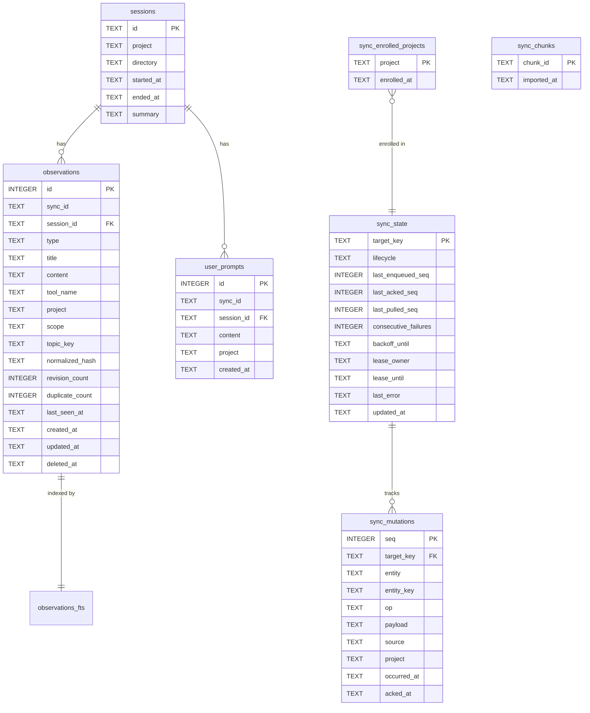
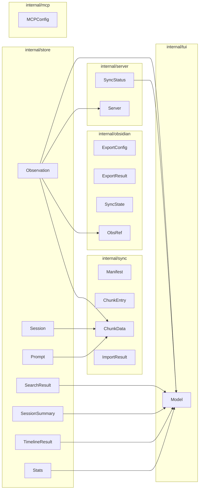

# Data Models

Engram's domain types live in `internal/store/` and are consumed across every subsystem — the HTTP server (`internal/server/`), MCP server (`internal/mcp/`), sync engine (`internal/sync/`), Obsidian exporter (`internal/obsidian/`), and TUI (`internal/tui/`). All structs use `json` struct tags for serialization over HTTP and MCP transports.

## Modeling Approach

| Concern | Strategy |
|---------|----------|
| Storage engine | SQLite via pure-Go driver with FTS5 full-text search |
| Soft deletes | Observations carry `deleted_at`; hard delete is opt-in (`?hard=true`) |
| Content dedup | `normalized_hash` + configurable `DedupeWindow` prevents redundant observations |
| Revision tracking | `revision_count` increments on topic-key upserts |
| Sync IDs | SHA-256 content hash prefix for idempotent cross-device sync |
| Project normalization | `NormalizeProject()` applied before all project operations |

---

## Core Domain Models

### Session

A bounded AI coding session scoped to a project and working directory.

**Source**: `internal/store/` · Referenced by: `internal/server/server.go`, `internal/sync/sync.go`, `internal/tui/model.go`

| Field | Type | JSON | Description |
|-------|------|------|-------------|
| `ID` | `string` | `id` | Unique session identifier |
| `Project` | `string` | `project` | Project name (auto-detected or explicit) |
| `Directory` | `string` | `directory` | Working directory path |
| `StartedAt` | `string` | `started_at` | ISO 8601 timestamp |
| `EndedAt` | `*string` | `ended_at` | Set when session closes |
| `Summary` | `*string` | `summary` | End-of-session summary text |

### SessionSummary

Enriched session view with observation count, returned by recent-sessions queries.

| Field | Type | JSON | Description |
|-------|------|------|-------------|
| `ID` | `string` | `id` | Session identifier |
| `Project` | `string` | `project` | Project name |
| `StartedAt` | `string` | `started_at` | ISO timestamp |
| `EndedAt` | `*string` | `ended_at,omitempty` | Close timestamp |
| `Summary` | `*string` | `summary,omitempty` | Session summary |
| `ObservationCount` | `int` | `observation_count` | Number of observations in this session |

Referenced in `internal/tui/model.go` as `Sessions []store.SessionSummary`.

### Observation

The primary knowledge unit — a typed, titled memory entry linked to a session. Indexed by FTS5 for full-text search across `title`, `content`, `type`, `project`, and `topic_key`.

**Source**: `internal/store/` · Referenced by: `internal/server/`, `internal/sync/sync.go`, `internal/obsidian/`, `internal/tui/model.go`

| Field | Type | JSON | Description |
|-------|------|------|-------------|
| `ID` | `int64` | `id` | Auto-incrementing primary key |
| `SyncID` | `string` | `sync_id` | Content hash for cross-device dedup |
| `SessionID` | `string` | `session_id` | FK → Session |
| `Type` | `string` | `type` | Category (`architecture`, `bugfix`, `preference`, etc.) |
| `Title` | `string` | `title` | Human-readable title |
| `Content` | `string` | `content` | Full observation body (max 50 000 chars) |
| `ToolName` | `*string` | `tool_name` | MCP tool that created this |
| `Project` | `*string` | `project` | Optional project override |
| `Scope` | `string` | `scope` | Visibility: `project` (default) or `global` |
| `TopicKey` | `*string` | `topic_key` | Stable key for upsert grouping |
| `RevisionCount` | `int` | `revision_count` | Times content was revised (default 1) |
| `DuplicateCount` | `int` | `duplicate_count` | Times identical content was seen (default 1) |
| `LastSeenAt` | `*string` | `last_seen_at` | Last deduplication hit |
| `CreatedAt` | `string` | `created_at` | Creation timestamp |
| `UpdatedAt` | `string` | `updated_at` | Last modification |
| `DeletedAt` | `*string` | `deleted_at` | Soft delete timestamp |

### SearchResult

Wraps an `Observation` with an FTS5 relevance rank.

```go
type SearchResult struct {
    Observation          // embeds all Observation fields
    Rank float64 `json:"rank"`
}
```

Referenced in `internal/tui/model.go` as `SearchResults []store.SearchResult`.

### Prompt

Stores raw user prompts for session replay and analysis.

| Field | Type | JSON | Description |
|-------|------|------|-------------|
| `ID` | `int64` | `id` | Auto-incrementing primary key |
| `SyncID` | `string` | `sync_id` | Content hash for sync dedup |
| `SessionID` | `string` | `session_id` | FK → Session |
| `Content` | `string` | `content` | Prompt text |
| `Project` | `string` | `project` | Project association |
| `CreatedAt` | `string` | `created_at` | Timestamp |

### TimelineResult

Temporal context around a focus observation.

```go
type TimelineResult struct {
    Focus        Observation     `json:"focus"`
    Before       []TimelineEntry `json:"before"`
    After        []TimelineEntry `json:"after"`
    SessionInfo  *Session        `json:"session_info"`
    TotalInRange int             `json:"total_in_range"`
}
```

Referenced in `internal/tui/model.go` as `Timeline *store.TimelineResult`.

### Stats

Aggregate counters for the entire store.

```go
type Stats struct {
    TotalSessions     int      `json:"total_sessions"`
    TotalObservations int      `json:"total_observations"`
    TotalPrompts      int      `json:"total_prompts"`
    Projects          []string `json:"projects"`
}
```

Referenced in both `cmd/engram/main.go` (exported as `Stats`) and `internal/tui/model.go`.

---

## Entity Relationship Diagram



---

## Sync Data Structures

The sync subsystem (`internal/sync/`) uses immutable, content-addressed chunk files to avoid git merge conflicts. Each export cycle produces a new `.jsonl.gz` chunk; existing chunks are never modified.

### Directory Layout

```
.engram/
├── manifest.json              ← chunk index (small, git-mergeable)
├── chunks/
│   ├── a3f8c1d2.jsonl.gz     ← compressed chunk (immutable)
│   ├── b7d2e4f1.jsonl.gz
│   └── ...
└── engram.db                  ← local working DB (gitignored)
```

### Manifest

**Source**: `internal/sync/sync.go`

```go
type Manifest struct {
    Version int          `json:"version"` // Schema version (1)
    Chunks  []ChunkEntry `json:"chunks"`
}
```

### ChunkEntry

One entry per chunk in the manifest — metadata only.

| Field | Type | JSON | Description |
|-------|------|------|-------------|
| `ID` | `string` | `id` | SHA-256 hash prefix (8 hex chars) |
| `CreatedBy` | `string` | `created_by` | Username or machine identifier |
| `CreatedAt` | `string` | `created_at` | ISO 8601 timestamp |
| `Sessions` | `int` | `sessions` | Session count in chunk |
| `Memories` | `int` | `memories` | Observation count in chunk |
| `Prompts` | `int` | `prompts` | Prompt count in chunk |

### ChunkData

Content of a single `.jsonl.gz` chunk file.

```go
type ChunkData struct {
    Sessions     []store.Session     `json:"sessions"`
    Observations []store.Observation `json:"observations"`
    Prompts      []store.Prompt      `json:"prompts"`
}
```

### SyncResult / ImportResult

```go
type SyncResult struct {
    ChunkID              string `json:"chunk_id,omitempty"`
    SessionsExported     int    `json:"sessions_exported"`
    ObservationsExported int    `json:"observations_exported"`
    PromptsExported      int    `json:"prompts_exported"`
    IsEmpty              bool   `json:"is_empty"`
}

type ImportResult struct {
    ChunksImported       int `json:"chunks_imported"`
    ChunksSkipped        int `json:"chunks_skipped"` // already imported
    SessionsImported     int `json:"sessions_imported"`
    ObservationsImported int `json:"observations_imported"`
    PromptsImported      int `json:"prompts_imported"`
}
```

### Transport Interface

**Source**: `internal/sync/transport.go`

```go
type Transport interface {
    ReadManifest() (*Manifest, error)
    WriteManifest(m *Manifest) error
    WriteChunk(chunkID string, data []byte, entry ChunkEntry) error
    ReadChunk(chunkID string) ([]byte, error)
}
```

`FileTransport` is the built-in local-filesystem implementation backed by `.engram/chunks/*.jsonl.gz`.

---

## Cloud Sync Models

Real-time sync uses a mutation log with lifecycle management and lease-based concurrency control.

**Tables**: `sync_state`, `sync_mutations`, `sync_enrolled_projects`

### SyncStatus (server)

**Source**: `internal/server/server.go`

```go
type SyncStatus struct {
    Phase               string     `json:"phase"`
    LastError           string     `json:"last_error,omitempty"`
    ConsecutiveFailures int        `json:"consecutive_failures"`
    BackoffUntil        *time.Time `json:"backoff_until,omitempty"`
    LastSyncAt          *time.Time `json:"last_sync_at,omitempty"`
}
```

The `SyncStatusProvider` interface abstracts how the server obtains this status:

```go
type SyncStatusProvider interface {
    SyncStatus() SyncStatus
}
```

---

## Project Management Types

### ProjectMatch

Used by `internal/project/similar.go` for fuzzy project-name matching.

```go
type ProjectMatch struct {
    Name      string // existing project name
    MatchType string // "case-insensitive" | "substring" | "levenshtein"
    Distance  int    // Levenshtein distance (0 for exact/substring matches)
}
```

`FindSimilar()` returns a sorted `[]ProjectMatch` ranked by distance.

### projectGroup (CLI)

Used in `cmd/engram/main.go` for the `projects consolidate` workflow.

```go
type projectGroup struct {
    Canonical string   // suggested canonical name (most observations)
    Names     []string // all similar project names in the group
}
```

---

## Obsidian Export Models

### SyncState (obsidian)

Tracks what has been exported to the Obsidian vault. Persisted at `{vault}/engram/.engram-sync-state.json`.

**Source**: `internal/obsidian/state.go`

| Field | Type | JSON | Description |
|-------|------|------|-------------|
| `LastExportAt` | `string` | `last_export_at` | Timestamp of last export |
| `Files` | `map[int64]string` | `files` | Observation ID → relative vault path |
| `SessionHubs` | `map[string]string` | `session_hubs` | Session ID → relative path |
| `TopicHubs` | `map[string]string` | `topic_hubs` | Topic prefix → relative path |
| `Version` | `int` | `version` | Schema version (1) |

Read/written via `ReadState()` and `WriteState()`.

### ExportConfig

CLI flags for the `engram obsidian-export` command.

**Source**: `internal/obsidian/exporter.go`

```go
type ExportConfig struct {
    VaultPath   string          // --vault (required)
    Project     string          // --project (optional filter)
    Limit       int             // --limit (0 = no limit)
    Since       time.Time       // --since (zero = use state file)
    Force       bool            // --force: full re-export
    GraphConfig GraphConfigMode // --graph-config: preserve|force|skip
}
```

### GraphConfigMode

**Source**: `internal/obsidian/graph.go`

```go
type GraphConfigMode string

const (
    GraphConfigPreserve GraphConfigMode = "preserve"
    GraphConfigForce    GraphConfigMode = "force"
    GraphConfigSkip     GraphConfigMode = "skip"
)
```

Parsed by `ParseGraphConfigMode()`, applied by `WriteGraphConfig()`.

### ExportResult

```go
type ExportResult struct {
    Created     int
    Updated     int
    Deleted     int
    Skipped     int
    HubsCreated int
    Errors      []error
}
```

### ObsRef

Lightweight reference for building Obsidian wikilinks in hub notes.

**Source**: `internal/obsidian/hub.go`

```go
type ObsRef struct {
    Slug     string // filename slug, e.g. "fixed-auth-bug-1"
    Title    string // human-readable title
    TopicKey string // may be empty
    Type     string // e.g. "bugfix", "architecture"
}
```

Used by `SessionHubMarkdown()` and `TopicHubMarkdown()` to generate hub note content. `ShouldCreateTopicHub()` determines whether a topic has enough observations to warrant a hub note.

### StoreReader

Interface the exporter uses to read from the store without a direct dependency.

```go
type StoreReader interface {
    Export() (/* export data */)
    Stats() (/* stats */)
}
```

### WatcherConfig

Configuration for the file-watching export loop.

**Source**: `internal/obsidian/watcher.go`

```go
type WatcherConfig struct {
    Exporter Exportable
    Interval time.Duration
    Logf     func(format string, args ...any)
}
```

The `Exportable` interface wraps `Export()` and `SetGraphConfig()`. `NewWatcher()` creates a `Watcher` that calls `Run()` in a loop with the configured interval.

---

## MCP & Server Models

### MCPConfig

**Source**: `internal/mcp/mcp.go`

```go
type MCPConfig struct {
    DefaultProject string // Auto-detected project, fallback when LLM sends empty project
}
```

Passed to `NewServerWithConfig()`. The `DefaultProject` is resolved via `internal/project/detect.go`'s `DetectProject()`, which checks git remote → git root → directory name, normalizing to lowercase.

### Server

**Source**: `internal/server/server.go`

```go
type Server struct { /* unexported fields */ }
```

Created via `New()`. Supports `SetOnWrite()` callback for triggering sync on data mutations and `SetSyncStatus()` via the `SyncStatusProvider` interface.

### Project Migration Request

Used by `POST /projects/migrate`.

```go
type migrateRequest struct {
    OldProject string `json:"old_project"`
    NewProject string `json:"new_project"`
}
```

---

## Setup Models

**Source**: `internal/setup/setup.go`

```go
type Agent struct {
    Name        string
    Description string
    InstallDir  string // resolved at runtime
}

type Result struct {
    Agent       string
    Destination string
    Files       int
}
```

`SupportedAgents()` returns the list of `Agent` values. `Install()` copies plugin files and returns a `Result`. `AddClaudeCodeAllowlist()` injects Engram's MCP tools into Claude Code's allowed tool list.

---

## Version Check Models

**Source**: `internal/version/check.go`

```go
type CheckStatus string

const (
    StatusUpToDate        CheckStatus = "up_to_date"
    StatusUpdateAvailable CheckStatus = "update_available"
    StatusCheckFailed     CheckStatus = "check_failed"
)

type CheckResult struct {
    Status  CheckStatus
    Message string
}
```

`CheckLatest()` queries the GitHub releases API (authenticated via `GH_TOKEN` or `GITHUB_TOKEN` env vars) and compares with the running version using semantic version parsing.

---

## Store Configuration

```go
type Config struct {
    DataDir              string        // Default: ~/.engram (override: ENGRAM_DATA_DIR)
    MaxObservationLength int           // Default: 50 000
    MaxContextResults    int           // Default: 20
    MaxSearchResults     int           // Default: 20
    DedupeWindow         time.Duration // Default: 15 min
}
```

---

## Validation Rules

| Rule | Enforcement Point | Details |
|------|-------------------|---------|
| Required fields on create | `internal/server/server.go` | `session_id`, `title`, `content` required for observations; `session_id`, `content` for prompts |
| At least one field on update | `internal/server/server.go` | PATCH rejects all-nil field payloads |
| Max content length | `internal/store/` | Observations truncated at `MaxObservationLength` (50 000 chars) |
| Dedup window | `internal/store/` | `normalized_hash` compared within `DedupeWindow` (15 min); matches increment `duplicate_count` |
| Import size limit | `internal/server/server.go` | `POST /import` body capped at 50 MB |
| Passive capture filters | `internal/store/` | Extracted learnings must be ≥ 20 chars and ≥ 4 words |
| Project name normalization | `internal/project/detect.go` | Lowercase, trimmed; git-based detection normalizes remote URLs |

---

## Cross-Layer Type Flow


